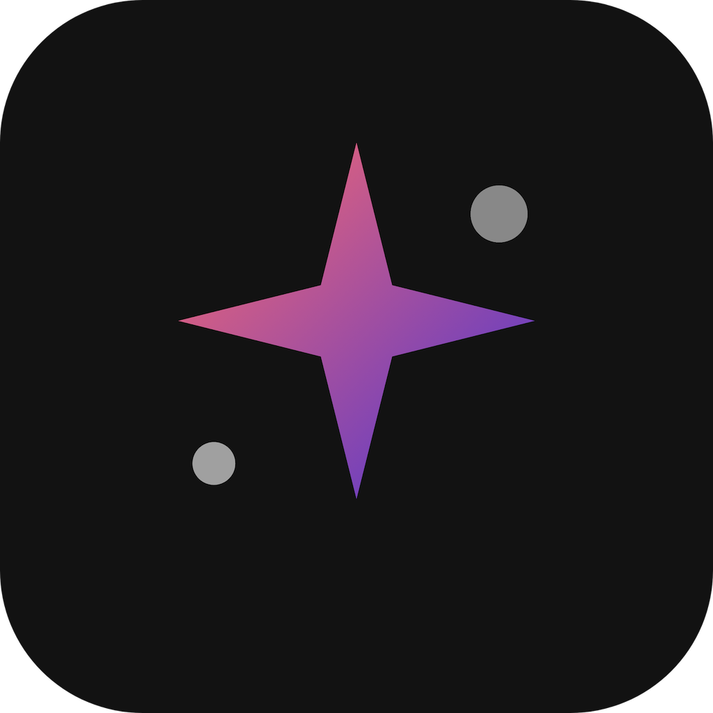

<p align="right"><a href="./README.md">English</a> | <b>Русский</b></p>

#  AIChat

<p align="left">
  
  
  
  
  
  
  
  
</p>

AI-чат приложение для iOS, построенное на **SwiftUI** с архитектурным паттерном **MVVM+C** (Model-View-ViewModel + Coordinator). Приложение предоставляет интеллектуальный чат-интерфейс на основе Dola AI API, с возможностью генерации видео через PixVerse API, управлением подписками через Apphud и современным тёмным интерфейсом с градиентными акцентами.

## ✨ Возможности

- **💬 AI Чат:** Интеллектуальный интерфейс общения с Dola AI ассистентом, с историей сообщений, функцией копирования и регенерации ответов.
- **🎬 Генерация видео:** Превращение фотографий в анимированные видео с использованием AI-шаблонов PixVerse с настройкой формата, качества и длительности.
- **📁 История чатов:** Просмотр и управление предыдущими разговорами с организованным списком, сгруппированным по дате.
- **💎 Управление подписками:** Внутренние покупки на базе Apphud SDK с интеграцией StoreKit 2 для недельных и годовых планов.
- **🎨 Современный UI:** Тёмная тема с градиентными акцентами, плавными Lottie-анимациями и адаптивным дизайном.
- **🔄 Structured Concurrency:** Построено на современных Swift-конкурентностях с использованием async/await и @MainActor для потокобезопасных операций.
- **🌍 Локализация:** Полная поддержка локализации с использованием String Catalog (Localizable.xcstrings).
- **🛡️ Обработка ошибок:** Комплексная обработка ошибок с дружелюбным интерфейсом повтора и всплывающими уведомлениями.

## 🖼️ Превью

<div align="center">

| Главный экран | Чат | Видео шаблоны |
|:---:|:---:|:---:|
|  |  |  |

</div>

## 🛠️ Технологии и архитектура

Проект построен с использованием архитектурного паттерна **MVVM+C (Model-View-ViewModel + Coordinator)** для обеспечения разделения ответственности, тестируемости и чистой навигации.

### ⚙️ Основные технологии

- **SwiftUI:** Для построения декларативного и отзывчивого пользовательского интерфейса.
- **Structured Concurrency:** Использование async/await, @MainActor и Task для безопасного параллельного выполнения.
- **Coordinator Pattern:** Для управления навигацией и декомпозиции views от логики навигации.
- **Protocol-based DI:** Сервисы внедряются через протоколы для тестируемости и гибкости.

### 📦 Зависимости (SPM)

- **[Apphud SDK](https://github.com/apphud/ApphudSDK):** Для управления подписками и внутриприложенческими покупками.
- **[Lottie](https://github.com/airbnb/lottie-spm):** Для рендеринга качественных векторных анимаций.

### 🔌 API

- **Dola AI API:** Бэкенд-сервис для функциональности AI-чата с историей сообщений и поддержкой персон.
- **PixVerse API:** Сервис AI-генерации видео, поддерживающий трансформацию фото в видео на основе шаблонов.

### 📏 Стандарты кода

- **Conventional Commits:** Все коммиты соответствуют спецификации [Conventional Commits](https://www.conventionalcommits.org/).
- **Private Extensions:** Все приватные функции и свойства организованы в приватных расширениях.
- **Локализация:** Все строки для пользователей используют `String(localized:)` для поддержки локализации.
- **Одна сущность на файл:** Каждая модель, view и сервис в собственном файле.

## 📁 Структура проекта

```text
AIChat/
├── App/
│   ├── AIChatApp.swift              # Точка входа приложения
│   └── Screen.swift                 # Определения экранов навигации
├── Helpers/
│   ├── Constants.swift              # Константы и API-ключи
│   ├── Date+GroupKey.swift          # Расширения для группировки дат
│   ├── Font+Ext.swift               # Определения кастомных шрифтов
│   ├── LinearGradient+Ext.swift     # Утилиты градиентов
│   ├── SFSymbol.swift               # Константы SF Symbol
│   ├── String+Ext.swift             # Утилиты парсинга строк
│   └── HTTPResponseValidator.swift  # Валидация сетевых ответов
├── Models/
│   ├── Chat/                        # Модели чата
│   │   ├── ChatMessage.swift
│   │   ├── ChatSection.swift
│   │   ├── DolaChat.swift
│   │   ├── DolaChatMessage.swift
│   │   ├── DolaMessageResponse.swift
│   │   └── ToastState.swift
│   ├── Paywall/                     # Модели подписок
│   │   ├── Benefit.swift
│   │   └── Plan.swift
│   ├── Video/                       # Модели генерации видео
│   │   ├── PixverseGenerationResponse.swift
│   │   ├── PixverseGenerationStatusResponse.swift
│   │   ├── TemplatesResponse.swift
│   │   ├── VideoCategory.swift
│   │   ├── VideoFormat.swift
│   │   ├── VideoQuality.swift
│   │   └── VideoTemplate.swift
│   └── Mock/                        # Моки для превью
├── Navigation/
│   └── Coordinator.swift            # Координатор навигации
├── Services/
│   ├── Chat/                        # Сервис Dola AI чата
│   │   ├── ChatService.swift
│   │   └── ChatServiceProtocol.swift
│   ├── Network/                     # Сетевой слой
│   │   ├── HTTPMethod.swift
│   │   ├── NetworkRequest.swift
│   │   ├── NetworkRequest+Ext.swift
│   │   └── Requests/               # Определения API-запросов
│   ├── Subscription/                # Сервис подписок Apphud
│   │   ├── SubscriptionService.swift
│   │   └── SubscriptionServiceProtocol.swift
│   └── VideoGeneration/             # Генерация видео PixVerse
│       ├── VideoGenerationService.swift
│       └── VideoGenerationServiceProtocol.swift
├── ViewModels/
│   ├── ChatViewModel.swift
│   ├── ChatListViewModel.swift
│   ├── PaywallViewModel.swift
│   ├── VideoGenerateViewModel.swift
│   └── VideoTemplatesViewModel.swift
├── Views/
│   ├── Chat/                        # Views экрана чата
│   ├── ChatList/                    # Views истории чатов
│   ├── Main/                        # Views главного экрана
│   ├── Paywall/                     # Views экрана подписок
│   ├── Video/
│   │   ├── ResultVideoGen/          # Views результата генерации видео
│   │   ├── TemplateSelection/       # Views выбора видео-шаблонов
│   │   └── VideoGenerate/           # Views настройки генерации видео
│   └── Components/                  # Переиспользуемые UI-компоненты
│       ├── Buttons/                 # Компоненты кнопок
│       ├── Cards/                   # Компоненты карточек
│       ├── Feedback/                # Тосты и ошибки
│       ├── Input/                   # Панель ввода и выпадающие списки
│       ├── Loading/                 # Индикаторы загрузки
│       ├── Lottie/                  # Lottie-анимации
│       └── Other/                   # Фон и юридические views
└── Resources/
    ├── Assets.xcassets/             # Ассеты изображений и цветов
    ├── Animations/                  # Файлы Lottie-анимаций
    ├── Fonts/                       # Кастомные шрифты
    ├── Info.plist                   # Конфигурация приложения
    ├── Localizable.xcstrings        # Строки локализации
    └── StoreConfiguration.storekit  # Конфигурация StoreKit
```

## 🚀 Установка

Проект использует **Swift Package Manager** для управления зависимостями.

1. **Клонируйте репозиторий:**

   ```bash
   git clone https://github.com/teenagelove/AIChat.git
   cd AIChat
   ```

2. **Откройте проект:**

   ```bash
   open AIChat.xcodeproj
   ```

3. **Соберите и запустите:**

   Выберите симулятор или устройство и нажмите `Cmd + R` для сборки и запуска проекта.

## 👥 Участники

- [Danil Kazakov](https://github.com/teenagelove) - Создатель и мейнтейнер

## 📄 Лицензия

Этот проект доступен под лицензией MIT. Подробности смотрите в файле [LICENSE](LICENSE).
